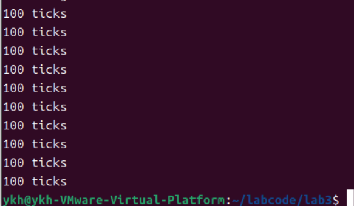
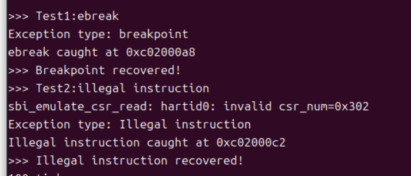

# OS Lab3实验报告
2313923叶坤豪

2314033 潘涛

2213633 翟玉坤

## 练习1：完善中断处理
### 任务要求
请编程完善trap.c中的中断处理函数trap，在对时钟中断进行处理的部分填写kern/trap/trap.c函数中处理时钟中断的部分，使操作系统每遇到100次时钟中断后，调用print_ticks子程序，向屏幕上打印一行文字”100 ticks”，在打印完10行后调用sbi.h中的shut_down()函数关机。

要求完成问题1提出的相关函数实现，提交改进后的源代码包（可以编译执行），并在实验报告中简要说明实现过程和定时器中断中断处理的流程。实现要求的部分代码后，运行整个系统，大约每1秒会输出一次”100 ticks”，输出10行。

### 实现
#### 1.实现过程
在trap.c文件中完善代码
```c
case IRQ_S_TIMER:
        // (1) 设置下次时钟中断
        clock_set_next_event();
            
        // (2) 计数器加一
        ticks++;
            
        // (3) 每100次中断输出提示信息
        if (ticks == TICK_NUM) {
            print_ticks();      // 输出"100 ticks"
            ticks = 0;         // 重置计数器
			num++;            // 打印次数加一
               
            // (4) 打印10次后关机
            if (num == 10) {
				sbi_shutdown();  // 调用关机函数
            }
        }
        break;
```
完成之后，我们在命令行输入make qemu,得到以下结果。



可以看到，成功实现了输出十行100 ticks之后结束进程。

#### 2.中断处理流程

时钟硬件触发中断 -> CPU保存上下文到 trapframe -> trap()函数分发到interrupt_handler() -> 识别为IRQ_S_TIMER类型 -> 执行定时器中断处理逻辑 -> 设置下次中断 → 计数累加 → 条件输出 → 条件关机 -> 恢复上下文，返回原程序

## Challenge1：描述与理解中断流程
### 任务要求
描述ucore中处理中断异常的流程（从异常的产生开始），其中mov a0，sp的目的是什么？SAVE_ALL中寄存器保存在栈中的位置是什么确定的？对于任何中断，__alltraps 中都需要保存所有寄存器吗？请说明理由。

### 回答
1.中断异常处理的步骤如下：
- 中断异常产生后，会跳转到寄存器stvec保存的地址执行指令，由于在内核进行初始化时将该寄存器设置为__ alltraps，所以跳转到了trapentry.S中的__alltraps标签处执行。
- 接着是保存所有寄存器，执行指令"move  a0, sp"，将栈顶指针保存到a0中
- 然后指令"jal trap"跳转到trap函数继续执行，接着trap函数将会调用函数trap_dispatch
- 在trap_dispatch函数中，通过结构体trapframe保存的cuase, 判断是中断还是异常，然后跳转到对应的处理函数interrupt_handler或expection_handler中。
- 当trap执行完成后，会返回，然后进入____trapret, 恢复所有寄存器，最后使用sert返回返回用户态或内核被中断处

2."mov a0,sp"的目的：RISC-V规定a0-a7用于存储函数参数。而之前SAVE_ALL指令中将所有寄存器保存作栈中，而sp指向的是所有寄存器构成结构体首地址，所以将sp赋值给a0实际类似于向trap函数传参的过程。

3.SAVE_ALL中寄存器保存的位置，是由结构体trapframe和pushregs中的定义顺序决定的。

4.__alltraps中都需要保存所有寄存器。理由：为了保证中断返回后被中断程序能恢复到完全相同的状态（所有寄存器值不变），必须在进入中断处理前保存所有寄存器，否则会导致程序逻辑错误或崩溃；此外，无法预知不同类型中断会使用哪些寄存器，全部保存是最安全和通用的做法。

## Challenge2 理解上下文切换机制 

 回答以下问题：在trapentry.S中汇编代码 csrw sscratch, sp；csrrw s0, sscratch, x0实现了什么操作，目的是什么？save all里面保存了stval scause这些csr，而在restore all里面却不还原它们？那这样store的意义何在呢？

### Challenge2分析及问题回答

trapentry.S这个文件充当了整个内核中的中断与异常处理入口，在这个文件的代码中，有两个核心的功能，即"Save"和"Restore",用于处理对于处理器上下文的保存和恢复。

### 问题回答

1. 在trapentry.S中汇编代码 csrw sscratch, sp；csrrw s0, sscratch, x0实现了什么操作，目的是什么？

- csrw sscratch, sp

此代码位于整个文件开头部分，这个代码的作用在于将当前的栈指针 `sp` 的值写进 `sscratch` ，对于 sscratch, 在整个中断和异常处理流程中，主要目的在于作为一个备用的栈指针，通过将sp栈指针值写入sscratch,得以实现保存先前上下文的sp栈指针，这样就可以通过这个"备份"来在后续的异常和中断处理中安全地使用内核栈。

- csrrw s0, sscratch, x0

此代码首先会将 `sscratch` 的目前的值写入进 `s0` 寄存器，然后将 `x0` 写入sscartch。通过这两个操作，一方面先前的sscratch的值得以通过s0寄存器进行备份，并存入栈中，另一方面，x0写入sscratch代表着此时处在内核模式，假如有嵌套异常出现，则可以借助检查sscratch的值是否为0，来确认是否为内核态进入异常。

2. save all里面保存了stval scause这些csr，而在restore all里面却不还原它们？那这样store的意义何在呢？

- save all里面保存了stval scause这些csr，而在restore all里面却不还原它们？

`stval` 和 `scause` 都是控制状态寄存器，且都是只读的，它们的作用在于记录异常触发时的信息，其中stval记录出错地址等内容，scause记录异常的原因码。对于这两个寄存器，它们是只读状态，没有办法进行恢复，且这些寄存器在异常发生时系统会自行基于异常情况和原因对其进行操作，因此理论上也不需要恢复它们。

- 这样store的意义何在？

对于包含在 `trap.c` 中的trap相关函数，有时候需要这些信息来进行问题分析和处理，因此 `store` 这些内容是有必要的,例如stval的信息可被用于获取缺页地址，scause的信息可被用于判断缺页异常还是系统调用等。


## Challenge3：完善异常中断
### 任务要求
编程完善在触发一条非法指令异常和断点异常，在 kern/trap/trap.c的异常处理函数中捕获，并对其进行处理，简单输出异常类型和异常指令触发地址，即“Illegal instruction caught at 0x(地址)”，“ebreak caught at 0x（地址）”与“Exception type:Illegal instruction"，“Exception type: breakpoint”。

### 实现

在trap.c文件中完善代码
```c
case CAUSE_ILLEGAL_INSTRUCTION:
		// 非法指令异常处理
		/* LAB3 CHALLENGE3   2313923 :  */
        /*(1)输出指令异常类型（ Illegal instruction）
        *(2)输出异常指令地址
		*(3)更新 tf->epc寄存器
        */
        cprintf("Exception type: Illegal instruction\n");
        cprintf("Illegal instruction caught at 0x%08x\n", tf->epc);
        tf->epc += 4;
		break;
case CAUSE_BREAKPOINT:
	//断点异常处理
        /* LAB3 CHALLLENGE3   2313923 :  */
		/*(1)输出指令异常类型（ breakpoint）
		*(2)输出异常指令地址
		*(3)更新 tf->epc寄存器
        */
        cprintf("Exception type: breakpoint\n");
        cprintf("ebreak caught at 0x%08x\n", tf->epc);
		tf->epc += 2;
        break;
```
为了验证我们的终端异常处理是否正确，我们在init.c文件中通过内联汇编编写一个简单的测试。
```c
// 简单测试异常处理
    cprintf("\n>>> Test1:ebreak\n");
    asm volatile("ebreak");
    cprintf(">>> Breakpoint recovered!\n");

    cprintf(">>> Test2:illegal instruction\n");
    asm volatile("mret");
    cprintf(">>> Illegal instruction recovered!\n");
```
测试结果如下



可以看到成功捕获了异常并输出了异常类型和异常指令触发地址。


## 实验重要知识点与 OS 原理
### 一、中断与异常机制
#### 1.1 实验知识点：中断/异常分类处理

实验体现：在 trap_dispatch() 中根据 tf->cause 符号区分中断和异常

OS原理对应：中断与异常的分类

- 中断：外部异步事件，与CPU执行无关（如时钟、I/O）

- 异常：同步事件，由CPU执行指令引发（如非法指令、页错误）

#### 1.2 实验知识点：上下文保存与恢复
实验体现：trapframe 结构体保存所有寄存器状态

OS原理对应：进程上下文切换

- 含义：保存被中断程序的完整执行状态

- 目的：确保中断返回后程序能继续正确执行

### 二、异常处理机制
#### 2.1 实验知识点：精确异常
实验体现：epc 寄存器指向导致异常的指令地址

OS原理对应：精确异常概念

- 含义：异常发生时，之前指令全部完成，之后指令全未执行

- 重要性：确保异常处理的可预测性

### 三、中断处理机制

#### 3.1 实验知识点：定时器中断
实验体现：时钟中断的周期性处理

```c
clock_set_next_event();  // 设置下次中断
ticks++;                 // 计数累加
```
OS原理对应：时间片轮转

- 时间管理：为分时调度提供时间基准


